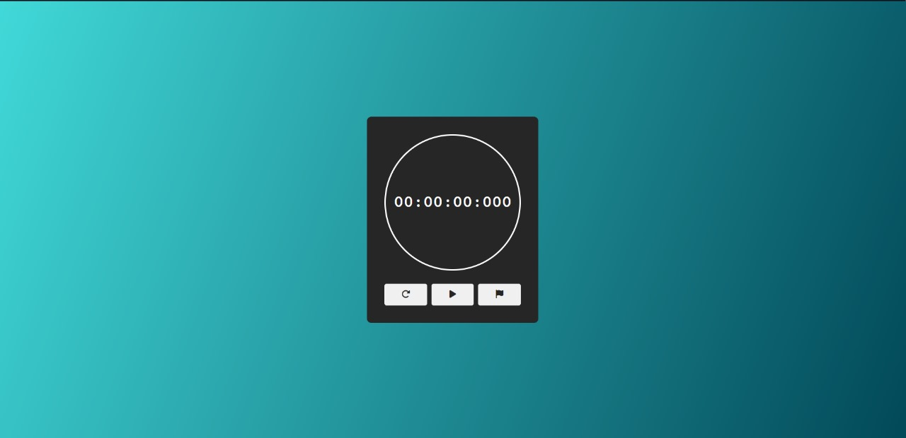

# TimerMob

Um cronômetro simples e elegante desenvolvido com HTML, CSS e JavaScript.

## Descrição

TimerMob é um cronômetro que permite iniciar, pausar, resetar e marcar tempos. Ele foi projetado para ser fácil de usar e visualmente agradável.

## Visualização

## Como usar

1. Faça o clone deste repositório.
  
2. Navegue até o diretório do projeto.
   
3. Abra o arquivo `index.html` em seu navegador preferido.

## Funcionalidades

- **Iniciar/Pausar/Continuar**: Controle total sobre o cronômetro com um único botão.
- **Resetar**: Restaure o cronômetro para zero.
- **Marcar**: Registre marcas de tempo enquanto o cronômetro está em execução.

## Tecnologias Utilizadas

- HTML5
- CSS3
- JavaScript
- Font Awesome

## Autor

[Juan Roberto](https://github.com/JuanRoberto1212)

## Licença

Este projeto está licenciado sob a [Licença MIT](LICENSE).
